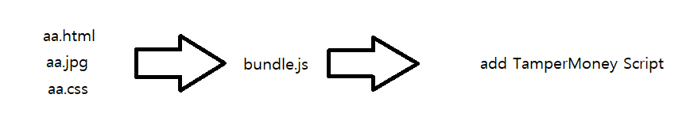

# Tampermonkey WebPack Template
<b>Node is required.</b>
<div align="center">
    <p>This is a userscript template with webpack applied.</p>
    <p>Combines HTML CSS JS + Picture files into files that can be used by TamperMonkey.</p>
    

</div>


## Contents
1. [Introduction](#introduction)
2. [Installation](#installation)
3. [Testing](#testing)
<hr>
#Introduction
The template contains the following packages.

|name|version|
|---|:---|
webpack|5.11.0
webpack-cli|4.3.0
webpack-dev-server|3.11.0
webpack-userscript|2.5.6
fontawesome-free|5.15.1"


**npm script list**
|command|Description|
|---|:---|
dev:build|development mode build
dev:watch|development mode watch(File change monitoring)
dev:hot|development mode hot-reloading
build|production build

```
root
├── dist (build files)
│   ├── bundle.meta.js
│   ├── bundle.user.js
│   └── index.html
├── headers.json
├── package-lock.json
├── package.json
├── public
│   └── test.html  # custom html
├── src
│   ├── a.css     # style
│   ├── a.jpg     # picture
│   ├── index.js  # main javascript
│   └── test.html # html tamplate
└── webpack.config.js
```
#### [return content](#contents)
<hr>


#Installation
```
git clone https://github.com/mp662002/tm_template.git
cd tm_template
npm install
npm run build
```
#### [return content](#contents)
<hr>
#Testing
**Browers Cache.. It helps if you press F12 to enter developer mode, then go to the network tab and select disable cache**

1. modify files  js.. html.. css.. in /src

1. Test it locally and add Tampermonkey later.
    - Use Watch
        > "watch" monitors files and builds them in real time. But it doesn't detect the "config" file.
        1. npm run dev:watch
        2. open the **dist/index.html**
        3. modify files...
        4. Browers Press "F5" or "Ctrl+R"

    - Use Hot
        > Hot-Reloading takes effect immediately without refreshing.
It is fast because it compiles in memory.
        1. npm run dev:hot
        2. Brosers opened
        3. modify files...
        4. Look at the browser. The changes will be applied.
    - Tampermonkey apply in local
        1. First build and copy meta.js text
        2. Create a new script in Tampermonkey and paste text
            - When using "Hot" or "Local Server".
                1. Add Header
                ```// @require http://127.0.0.1:8080/bundle.user.js```
            - If not.
                1. Add Header
                ```// @require file:///C:\Users\root\Desktop\tm\bundle.user.js```
1. Target site test
    1. npm run build
    1. Copy the contents of the bundle.user.js file.
    1. Paste it into the TamperMonkey Script.
    1. Edit the match header to the address you want.

1. how using target site hot-loading?
    **It is possible, but it will be difficult.
    HTTP site is possible. (Applied after saving twice.)
    HTTPS requires modifying the xhr used by webpack or bypassing the CORS option.**

#### [return content](#contents)
